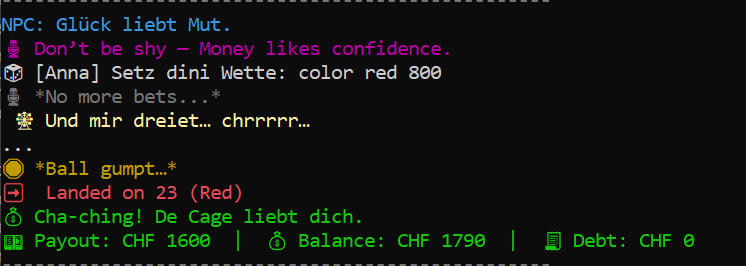
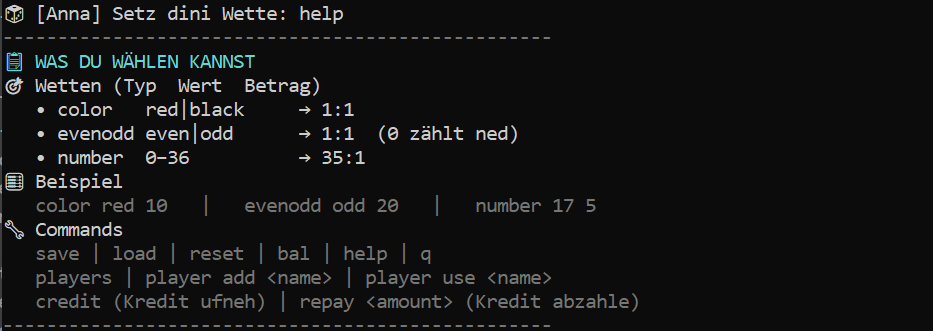
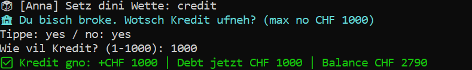
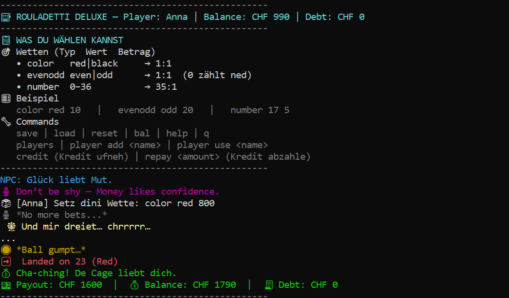
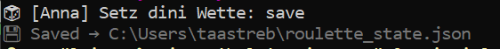

# 🎰 PowerShell Roulette – Projektdokumentation

> **Projekt:** Roulette - Multi-Player + Kredit + Zinse  
> **Sprache:** PowerShell  
> **Autor:** Anna, Remy  
> **Datum:** 13.01.2026

---

## 1. Projektübersicht
Dieses PowerShell Skript simuliert ein Roulette Spiel.
Es unterstützt mehrere Spieler, verschiedene Wettarten sowie eine Kreditfunktion mit automatischer Verzinsung der Schulden. Es ist dafür gedacht das man das Casino erlebniss haben kann ohne das man sein eigenes Geld verwetten muss und keine suchtgefahr besteht. Wie bei echten Casinos.

---

## 2. Voraussetzungen
- Betriebssystem: Windows 10 / Windows 11
- PowerShell: Version 7.x

---

## 3. Installation & Ausführung
- Skriptdatei: roulette.ps1
- Datei in einen beliebigen Ordner speichern
- cd (Pfad-zum-Skript) .\roulette.ps1

---

## 4. Spielbefehle
| Typ     | Wert        | Auszahlung |
|---------|-------------|------------|
| color   | red / black | 1:1        |
| evenodd | even / odd  | 1:1        |
| number  | 0–36        | 35:1       |

Mit dieser Vorgehensweise muss man seine Wette plazieren.
Zuerst muss man auswählen welchen auf was man Wetten möchte also Farbe, gerade oder ungerade oder direkt auf eine Zahl danach macht man einen abstand und schreibt dann hin entweder welche Farbe oder gerade oder ungerade und dann am schluss noch den Betrag den man setzen möchte.

Beispiel:
- color red/black 100
- evenodd even/odd 100
- number 0-36 100
- 

  ---
  
## 5. Allgemeine Befehle
| Befehl | Beschreibung |
|--------|--------------|
| help   | Zeigt das Hilfemenü |
| bal    | Zeigt Guthaben, Schulden und gespielte Runden |
| save   | Speichert den aktuellen Spielstand |
| load   | Lädt den gespeicherten Spielstand |
| reset  | Setzt das Spiel zurück |
| q      | Beendet das Spiel |

---

## 6. Spielerverwaltung
| Befehl              | Funktion |
|---------------------|----------|
| players             | Zeigt alle vorhandenen Spieler |
| player add `<Name>` | Fügt einen neuen Spieler hinzu |
| player use `<Name>` | Wechselt den aktiven Spieler |

---

## 7. Kredit und Schulden
| Befehl             | Beschreibung |
|--------------------|--------------|
| credit             | Kredit aufnehmen |
| repay `<Betrag>`   | Schulden zurückzahlen |

Regeln:
- Maximales Kreditlimit: 1000 CHF
- Zinsen: 1 % alle 5 gespielten Runden
- Die Verzinsung erfolgt automatisch

---  

## 8. Spielablauf
1. Das Skript wird gestartet und ein aktiver Spieler festgelegt
2. Der Spieler gibt eine Wette ein
3. Das Roulette wird gedreht und eine Zahl ermittelt
4. Gewinn oder Verlust wird berechnet
5. Guthaben und Schulden werden aktualisiert
6. Der Spielstand wird automatisch gespeichert

---

## 9. Speicherung des Spielstands

Der Spielstand wird in der Datei roulette_state.json gespeichert.
Diese Datei enthält alle relevanten Informationen, um das Spiel jederzeit fortsetzen zu können.

Gespeichert werden unter anderem:
- Spielername
- Guthaben
- Schulden
- Anzahl gespielter Runden
 
  
